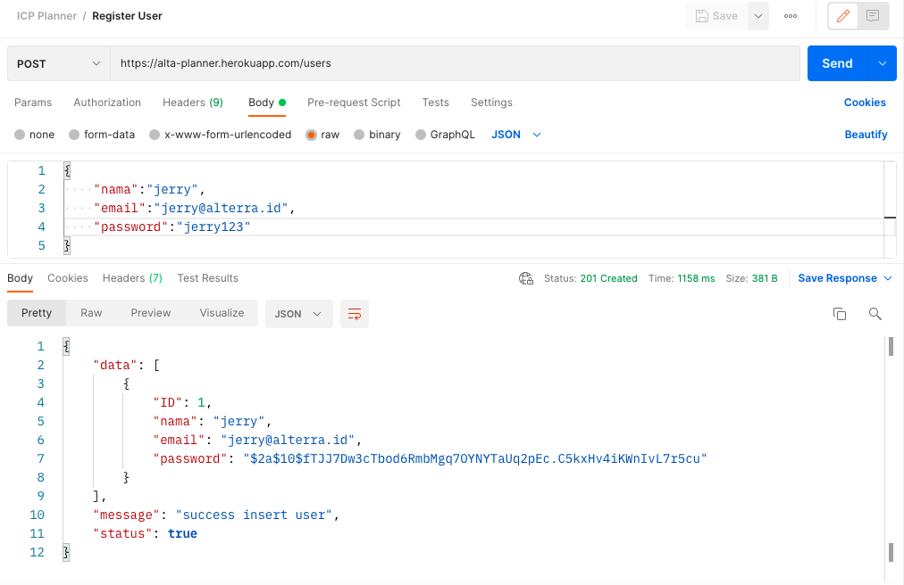

# ICP ALTA Planner Backend

Repository ini adalah keseluruhan code yang dibahas dalam materi. Silahkan download code ini dan selamat mencoba!!!

### Penjelasan folder:
---
<details>
    <summary>controller</summary>
        Folder ini bertugas untuk menangani lalulintas kegiatan aplikasi melalui protokol HTTP. Tugas utama yang dilakukan adalah membaca request dan memberikan respond untuk user.
</details>
<details>    
    <summary>model</summary>
        Folder ini bertugas untuk mendefinisikan data susunan informasi yang akan disimpan dalam database. Selain itu, bagian ini juga digunakan untuk melakukan proses baca tulis data pada database. (Untuk saat ini kita pake database berupa array dulu yak!!)
</details>


### Yang kamu perlukan buat mencoba program ini
---
Download beberapa tools ini ya
- [VSCode](https://code.visualstudio.com/download) buat nulis coding
- [Golang](https://go.dev/doc/install) **WAJIB BANGET NIH!!**
- [Postman](https://www.postman.com/downloads) buat nyobain coding kalian

Daftar akses yang bisa digunakan bisa dilihat [disini](https://app.swaggerhub.com/apis-docs/JerryBE1709/planner/1.0.0)

### Let's start:
---
1. Download repository ini. (Bisa klik [disini](https://github.com/jackthepanda96/icp-planner/archive/refs/heads/main.zip) atau pake mekanisme `clone` )
2. Buka folder projectnya di `VSCode`
3. Jalankan program
    ```go
    go run main.go
    ```
4. Coba akses lewat `Postman`

### Contoh akses
---
